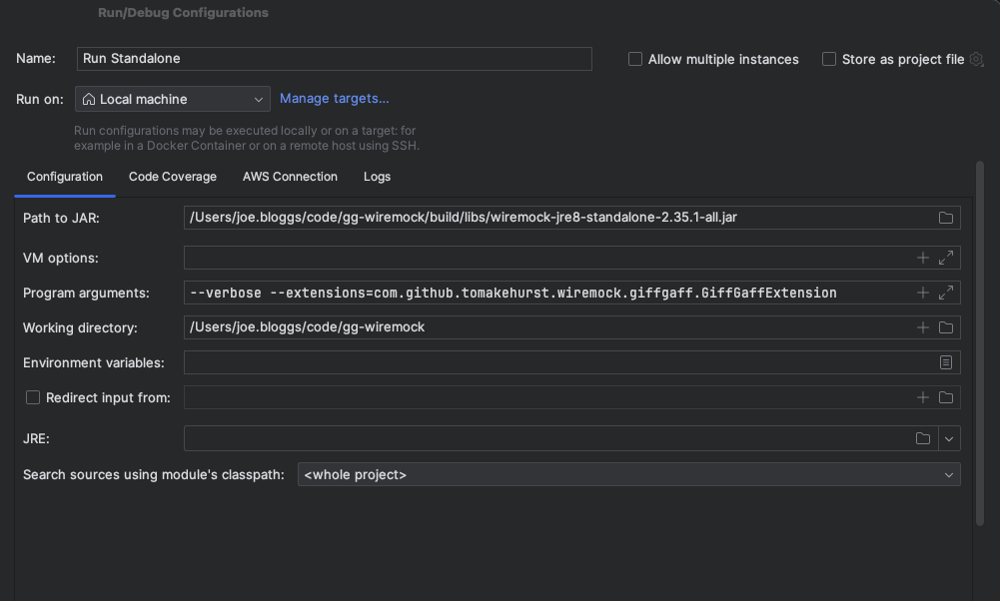

GiffGaff WireMock - a (modified) web service test double for all occasions
======================================================

Originally forked from [Wiremock](https://github.com/wiremock/wiremock/tree/master) this projects takes the latest version of 2.x and modifies the logging to produce json with common B3 fields (e.g. trace id) while running in standalone mode. 

Note [Version 3](https://github.com/wiremock/wiremock/releases) of WireMock has introduced breaking changes which prevent us from (currently) migrating.

### Building

To run all of WireMock's tests, run `./gradlew test`

To build the standalone JAR run `./gradlew shadowJar` The built JAR will be in `build/libs`.

To publish the JARs to your local Maven repository run `./gradlew publishToMavenLocal`

### Running

To populate trace and span information in the logs set the flag `--extensions=com.github.tomakehurst.wiremock.giffgaff.GiffGaffLoggingExtension`. 

Optionally, set the `--verbose` flag to log all incoming requests.

