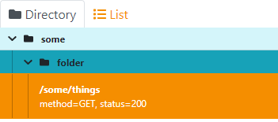
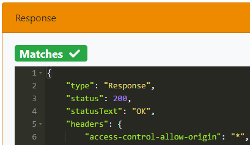
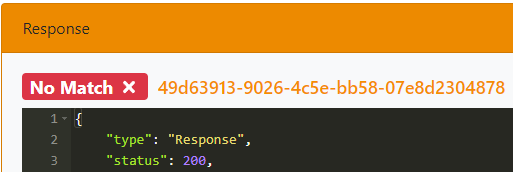

# WireMock with GUI

Extends WireMock with a graphical user interface

## Key Features
- Mappings
  - A paginated list or folder view of all mappings
  - Search for mappings
  - Add / Edit / Remove new mappings 
  - Add templates directly into mapping (Response Templating, Proxying, etc.)
  - Save / Reset / Remove all mappings
  - Reset all scenarios
  - Separated view improve readability
  - Test mapping
    - Allows to quickly test the mapping by sending http requests.
- Matched
  - A paginated list of all requests which could be handled by Wiremock
  - Copy cUrl
  - Reset Journal
- Unmatched
  - A paginated list of all requests which could not be handled by Wiremock
  - Copy cUrl
  - Copy request to clipboard for new mapping creation
  - Copy SOAP to clipboard which understands not matched SOAP requests and help during creation
  - Reset Journal
- StateMachine (experimental)
  - A paginated list of all mappings which are part of a scenario
  - States are calculated automatically
  - Mappings are represented as links
  - Button on links allows to show mapping details
- Record/playback of stubs
  - Help to start recording or snapshot
- Auto refresh when mappings or requests changes

## Where do I find the GUI?
The gui is part of the Wiremock admin interface. Therefore, just open the following URL: 

\<Wiremock baseUrl\>/__admin/webapp

## Folder view
Since 2.32.0.2

For mappings the folder view is selected by default. It is still possible to switch easier list view as well.

If mappings are stored on a drive in different directories this structure will be extracted and mappings metadata will be updated so that wiremock-gui can show the same folder structure.

You can also manually update mapping metadata to create a structure. This helps if you do not store mappings but load them via http, or if you do not want to place the file in different directories.

metadata structure:
```json
{
     "metadata": {
          "wiremock-gui": {
               "folder": "/some/folder"
          }
     }
}
```
will create following structure in gui:


### drag-and-drop
drag-and-drop into folders is currently <b>not</b> supported. It is a more complex topic, as it is currently not possible to sort mappings. 

There is a branch on which drag-and-drop is implemented. So if you are interested you can test it there. Due to the mentioned not supported sorting mappings might jump to a different location after reloading.

# Test mappings
Since 2.32.0.2

Allows testing of mappings via an HTTP request. This feature tries to extract url and content-type from mapping information. The prefilled data highly depends on how the request in the mapping is defined.

When executing the request the response is shown and also a badge which indicates if the selected mapping answered the request. If this is the case the following is shown:


If another mapping answered the request no match is shown and a link to the mapping which answered the request:


Keep in mind this feature will never be as powerful as tools like Postman, Insomnia, etc. So the overall idea is to provide a quick way to test if your mapping is properly setup.

## Features except gui
Custom Handlebars helpers

| Name          | Parameter     | Description   |
| ------------- | ------------- | ------------- |
| JWT           | algo          | Signing algorithm. Check jsonwebtoken for SignatureAlgorithm. E.g. RS256 |
|               | key           | Base64 encoded key to use. Kind of key depends on used algo |
|               | claims        | a json string which describes the claims to use. Must not be null in case no payload is defined |
|               | payload       | a json string which contains the content of the jwt. Must not be null in case no claims are defined |
|               | header        | a json string which contains the header to use |

## Configuration
Wiremock parameters can be passed via the environment variable WIREMOCK_OPTIONS. The values need to be of the following form:
```
--<param>,--<param>
```

## Docker Compose
A short example of a compose file
```
version: "3"
services:
  wiremock:
    image: "holomekc/wiremock-gui:latest"
    container_name: my_wiremock
    ports:
      # This is just an example of a port mapping
      - "8088:8089"
      - "8084:8088"
    environment:
      WIREMOCK_OPTIONS: "--port=8089,--https-port=8088,--max-request-journal=1000,--local-response-templating,--root-dir=/home/wiremock/storage"
```

## Images
[Mappings](./images/mappings.png)

[Separated View](./images/mappings-separated.png)

[StateMachine](./images/state-machine.png)

[Test](./images/test.png)

[Test Response](./images/test-response.png)