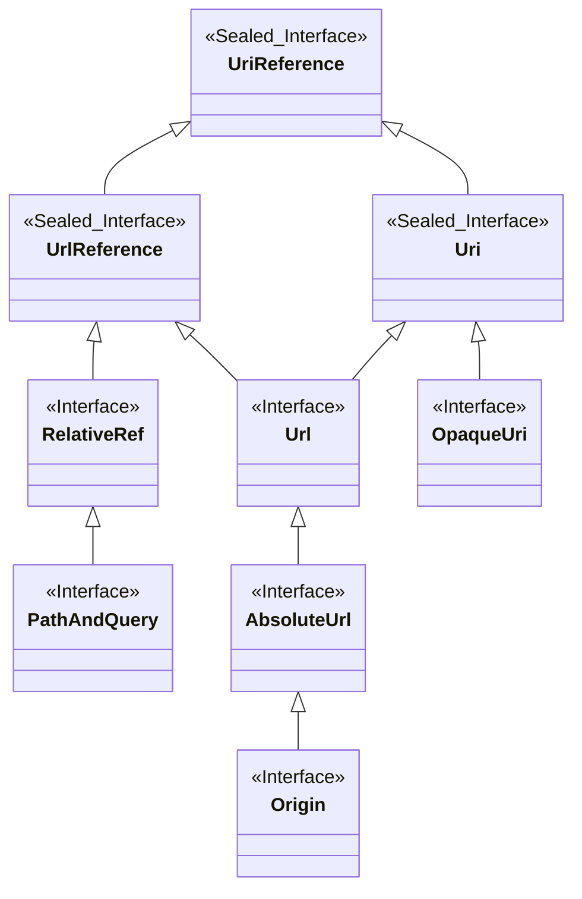

# WireMock URL

A type-safe, immutable URL parsing and manipulation library for Java, designed for lenient parsing
and RFC 3986 compliance.

## Overview

WireMock URL provides a robust set of tiny types for working with URLs and their components. The
library balances strict RFC 3986 compliance with practical leniency, accepting all valid RFC 3986
URLs while being permissive with path, query, and fragment components.

## Usage

### Parsing URLs

```java
Url url = Url.parse("https://example.com/path?query=value#fragment");
```

### Normalization

```java
Host host = Host.parse("EXAMPLE.COM%2fpath");
Host normalised = host.normalise();  // Returns "example.com%2Fpath"
```

### Decoding

```java
Fragment fragment = Fragment.parse("section%20name");
String decoded = fragment.decode();  // Returns "section name"
```

## Components

The library provides:

* A class hierarchy of tiny types representing types of URI Reference (see diagram below)
* Tiny types representing the components of URIs
* Parsers for producing these types from String representations

### URI Types
- **UriReference**: Either a URI (a URL or an Opaque URI), or a RelativeRef
- **Uri**: Either a URL or an Opaque URI
- **Url**: A URL, which is a URI with a scheme and an authority, e.g. `http://example.com/foo?q#f`
- **OpaqueURI**: A URI with a scheme but no authority, e.g. `mailto:me@example.com`
- **RelativeRef**: A relative reference, lacking a scheme and possibly an authority.
  e.g. `//example.com/foo?q#f`
- **UrlReference**: Either a URL or a relative reference. `Url.resolve(UrlReference)` can return
  `Url` because is guaranteed to produce a `Url`, whereas `Url.resolve(UriReference)` can only
  return `Uri` because it may produce an `OpaqueUri`.
- **PathAndQuery**: A specialisation of `RelativeRef` that contains neither an authority nor a
  fragment. Used in the request line of an HTTP request.
- **AbsoluteUrl**: A specialisation of `Url` that contains no fragment. Used in the request line of
  an HTTP request when using an HTTP proxy.
- **Origin**: A specialisation of `Url` which contains only a normalised scheme, host and (optional)
  port.

### URI Components

- **Scheme**: Scheme component (http, ftp, ssh etc.)
- **Authority**: Optional userinfo, host and optional port
- **HostAndPort**: Specialisation of `Authority` with no `UserInfo`. As found in an HTTP Request's
  `Host` header.
- **UserInfo**: Part of the Authority before the `@`
- **Username**: Part of the userinfo before the first `:`
- **Password**: Part of the userinfo after the first `:`
- **Host**: Host component (domain, IPv4, IPv6)
- **Port**: Port component (e.g. `80`, `080`)
- **Path**: Path component
- **Query**: Query string component
- **Fragment**: Fragment identifier
- **Segment**: Individual path segments

### Generalised Concepts

- **PercentEncoded**: Indicates a component that is percent encoded (contains e.g. `%20`). It's
  `toString` will be percent encoded, but it has a `decode()` method that will decode it to the
  unencoded value. Should have corresponding static `parse` (taking a percent encoded string and 
  wrapping it) and `encode` (taking an unencoded value and encoding it) methods.
- **Normalisable**: Indicates a component that can be normalised into its normal form


## Design Goals

### Core Objectives

- **Type Safety**: Leverage Java's type system with domain-specific tiny types for URL components
- **Ease of Use**: Simple, intuitive API for common URL manipulation tasks (e.g., modifying query
  parameters)
- **Lenient Parsing**: Accept all RFC 3986 compliant URLs with additional leniency:
  - **Path**: Accepts all non-control characters except `?` and `#`
  - **Query**: Accepts all non-control characters except `#`
  - **Fragment**: Accepts all non-control characters
- **Normalization**: RFC 3986 compliant normalization via `normalise()` method, which
  percent-encodes path, query, and fragment components as needed

### Design Principles

#### Immutability

All types are immutable, except for builder classes. This ensures thread safety and prevents
accidental modification.

#### Consistent API

All types provide a standard parsing interface:

```java
static Type parse(CharSequence stringForm);
```

Types implementing `PercentEncoded` additionally provide:

```java
static Type encode(CharSequence unencoded);
```

#### Invariants

The library maintains the following invariants:

1. **Parse Idempotence**: For all types, parsing and converting to string preserves the original
   input:
   ```java
   Type.parse(input).toString().equals(input) == true;
   ```

2. **Normalization Idempotence**: Normalization is idempotent:
   ```java
   instance.normalise().equals(instance.normalise().normalise()) == true;
   ```

3. **Round-Trip Equality**: In general, round-tripping through parse and toString preserves equality:
   ```java
   UrlReference.parse(urlReference.toString()).equals(instance) == true;
   ```

   **Note**: There are edge cases where this is not possible. For example, a `PathAndQuery`
   starting with `//` will be parsed as a `RelativeRef` when converted to string and re-parsed.
