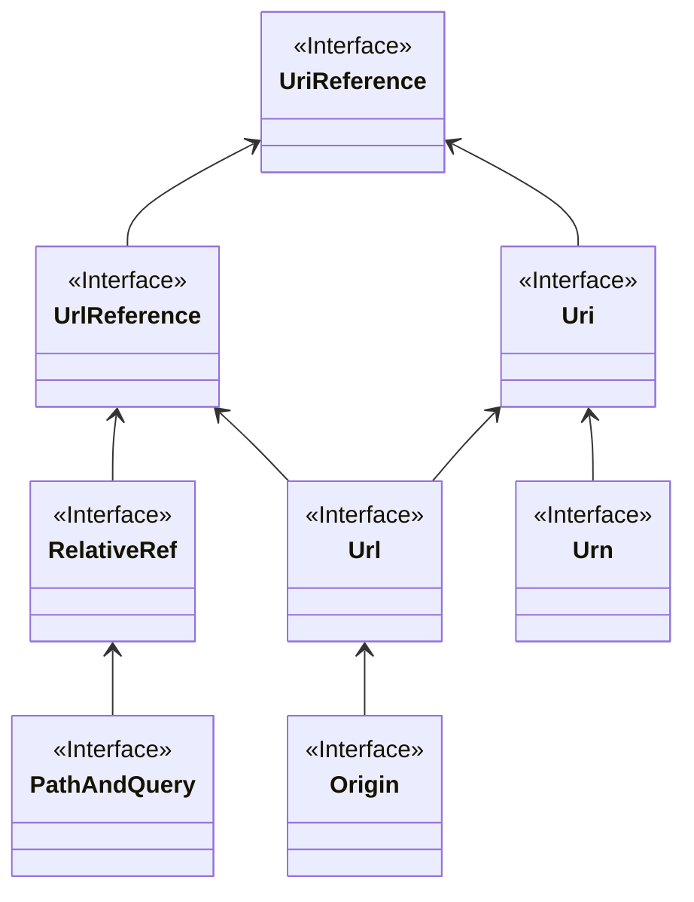

```mermaid

classDiagram
direction BT
class PathAndQuery {
<<Interface>>

}
class RelativeRef {
<<Interface>>

}
class Uri {
<<Interface>>

}
class UriReference {
<<Interface>>

}
class Url {
<<Interface>>

}
class Origin {
<<Interface>>

}
class UrlReference {
<<Interface>>

}
class Urn {
<<Interface>>

}

PathAndQuery  -->  RelativeRef 
RelativeRef  -->  UrlReference 
Uri  -->  UriReference 
Url  -->  Uri 
Url  -->  UrlReference 
Origin --> Url
UrlReference  -->  UriReference 
Urn  -->  Uri 
```