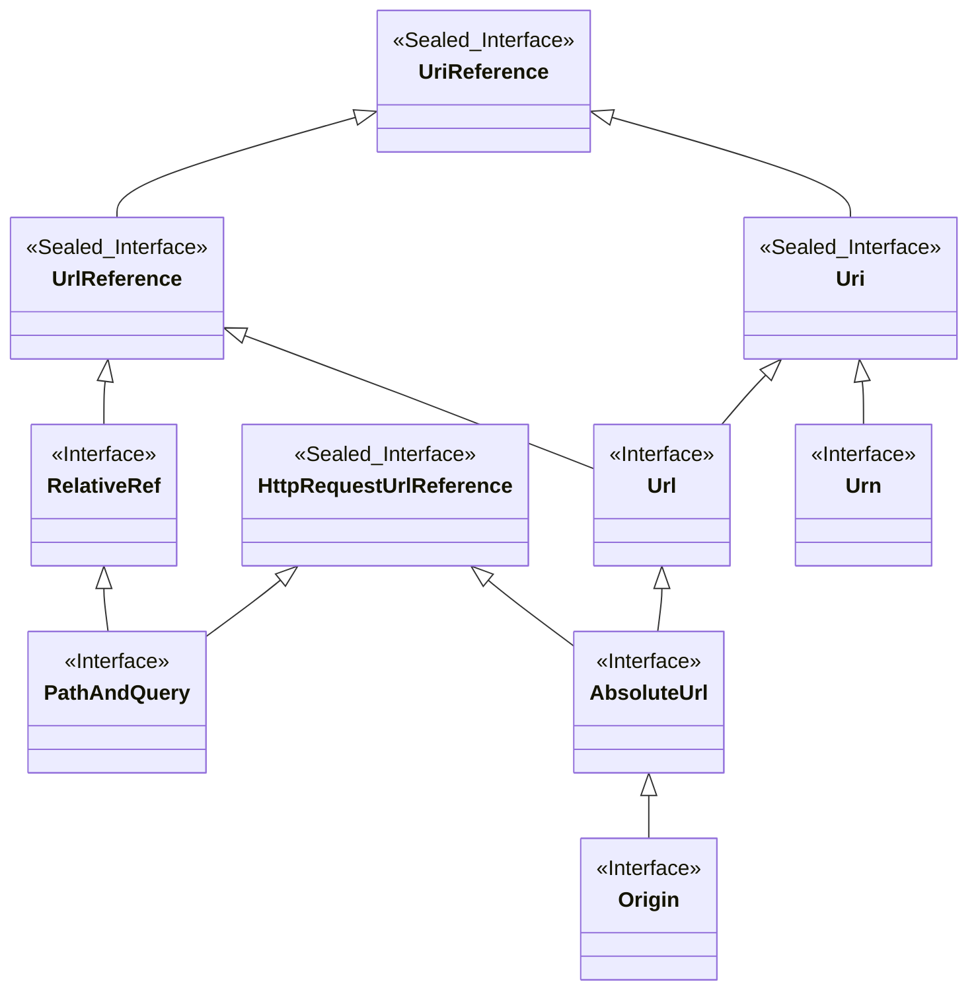

```mermaid

classDiagram
direction TB

class UriReference {
  <<Sealed_Interface>>

}

class UrlReference {
  <<Sealed_Interface>>

}

class Uri {
  <<Sealed_Interface>>

}

class RelativeRef {
<<Interface>>

}

class HttpRequestUrlReference {
  <<Sealed_Interface>>

}

class Url {
<<Interface>>

}

class Urn {
  <<Interface>>

}

class PathAndQuery {
<<Interface>>

}

class AbsoluteUrl {
<<Interface>>

}

class Origin {
<<Interface>>

}

UriReference <|-- UrlReference 
UriReference <|-- Uri
UrlReference <|-- RelativeRef
UrlReference <|-- Url 
Uri <|-- Url 
Uri <|-- Urn 
RelativeRef <|-- PathAndQuery 
HttpRequestUrlReference <|-- PathAndQuery 
HttpRequestUrlReference <|-- AbsoluteUrl
Url <|-- AbsoluteUrl
AbsoluteUrl <|-- Origin
```