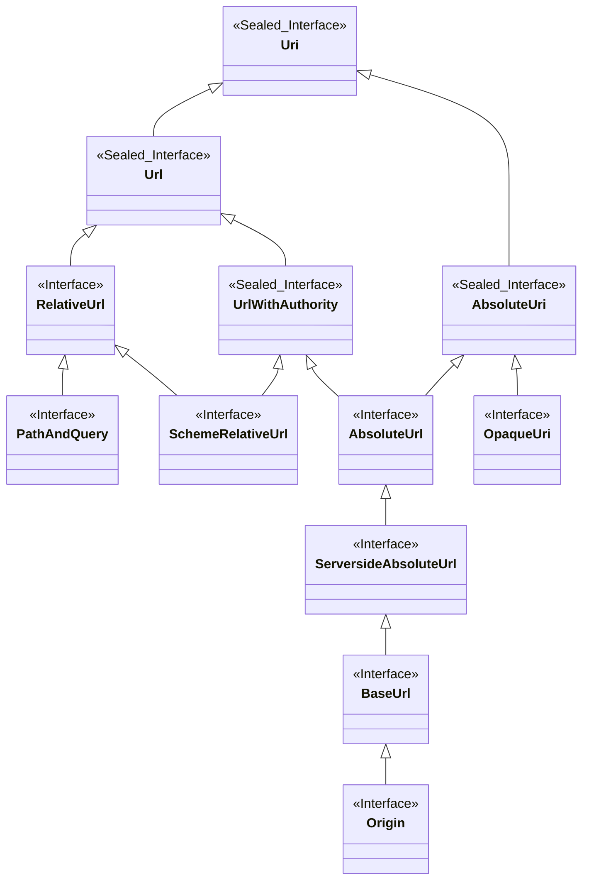

# WireMock URL

A type-safe, immutable URL parsing and manipulation library for Java, designed for lenient parsing
and RFC 3986 compliance.

## Overview

WireMock URL provides a robust set of tiny types for working with URLs and their components. The
library balances strict RFC 3986 compliance with practical leniency, accepting all valid RFC 3986
URLs while being permissive with path, query, and fragment components.

## Usage

### Parsing URLs

```java
Url url = Url.parse("https://example.com/path?query=value#fragment");
```

### Normalization

```java
Host host = Host.parse("EXAMPLE.COM%2fpath");
Host normalised = host.normalise();  // Returns "example.com%2Fpath"
```

### Decoding

```java
Fragment fragment = Fragment.parse("section%20name");
String decoded = fragment.decode();  // Returns "section name"
```

## Components

The library provides:

* A class hierarchy of tiny types representing types of URI Reference (see diagram below)
* Tiny types representing the components of URIs
* Parsers for producing these types from String representations

### URI Types
- **Uri**: Either an Absolute URI (an Absolute URL or an Opaque URI), or a Relative URL
- **AbsoluteUri**: Either an Absolute URL or an Opaque URI
- **Url**: Either an Absolute URL or a Relative URL. `AbsoluteUrl.resolve(Url)` can return
  `AbsoluteUrl` because it is guaranteed to produce an `AbsoluteUrl`, whereas
  `AbsoluteUrl.resolve(Uri)` can only  return `AbsoluteUri` because it may produce an `OpaqueUri`.
- **UrlWithAuthority**: Either an Absolute URL or a Scheme Relative URL.
  `Scheme.resolve(UrlWithAuthority)` can return `AbsoluteUrl` because it is guaranteed to produce an
  `AbsoluteUrl`, whereas `Scheme.resolve(Url)` can only return `AbsoluteUri` because it may produce
  an `OpaqueUri` (a `Url` may not contain an `Authority`).
- **AbsoluteUrl**: A URI with a scheme and an authority, e.g. `http://example.com/foo?q#f`
- **RelativeUrl**: A relative reference, lacking a scheme and possibly an authority.
  e.g. `//example.com/foo?q#f` or `/foo?q#f`
- **SchemeRelativeUrl**: A specialisation of `RelativeUrl` that has an authority.
- **OpaqueURI**: A URI with a scheme but no authority, e.g. `mailto:me@example.com` or `file:/home`
- **PathAndQuery**: A specialisation of `RelativeUrl` that contains neither an authority nor a
  fragment. Used in the request line of an HTTP request.
- **ServersideAbsoluteUrl**: A specialisation of `AbsoluteUrl` that contains no fragment. Used in
  the request line of an HTTP request when using an HTTP proxy.
- **BaseUrl**: A specialisation of `AbsoluteUrl` whose path is either empty or ends with a slash,
  and which has neither a query nor a fragment. Typically used as a configuration parameter, as
  you can always resolve a relative path (and query and fragment) onto it and it will effectively be
  appended to the base url.
- **Origin**: A specialisation of `AbsoluteUrl` which contains only a normalised scheme, host and
  (optional) port. Used as the origin for a user agent doing content security.

### URI Components

- **Scheme**: Scheme component (http, ftp, ssh etc.)
- **Authority**: Optional userinfo, host and optional port
- **HostAndPort**: Specialisation of `Authority` with no `UserInfo`. As found in an HTTP Request's
  `Host` header.
- **UserInfo**: Part of the Authority before the `@`
- **Username**: Part of the userinfo before the first `:`
- **Password**: Part of the userinfo after the first `:`
- **Host**: Host component (domain, IPv4, IPv6)
- **Port**: Port component (e.g. `80`, `080`)
- **Path**: Path component
- **Query**: Query string component
- **Fragment**: Fragment identifier
- **Segment**: Individual path segments

### Generalised Concepts

- **PercentEncoded**: Indicates a component that is percent encoded (contains e.g. `%20`). It's
  `toString` will be percent encoded, but it has a `decode()` method that will decode it to the
  unencoded value. Should have corresponding static `parse` (taking a percent encoded string and 
  wrapping it) and `encode` (taking an unencoded value and encoding it) methods.
- **Normalisable**: Indicates a component that can be normalised into its normal form


## Design Goals

### Core Objectives

- **Type Safety**: Leverage Java's type system with domain-specific tiny types for URL components
- **Ease of Use**: Simple, intuitive API for common URL manipulation tasks (e.g., modifying query
  parameters)
- **Lenient Parsing**: Accept all RFC 3986 compliant URLs with additional leniency:
  - **Path**: Accepts all non-control characters except `?` and `#`
  - **Query**: Accepts all non-control characters except `#`
  - **Fragment**: Accepts all non-control characters
- **Normalization**: RFC 3986 compliant normalisation via `normalise()` method, which
  percent-encodes path, query, and fragment components as needed

### Design Principles

#### Immutability

All types are immutable, except for builder classes. This ensures thread safety and prevents
accidental modification.

#### Consistent API

All types provide a standard parsing interface:

```java
static Type parse(String stringForm);
```

Types implementing `PercentEncoded` additionally provide:

```java
static Type encode(String unencoded);
```

#### Invariants

The library maintains the following invariants:

1. **Parse Idempotence**: For all types, parsing and converting to string preserves the original
   input:
   ```java
   Type.parse(input).toString().equals(input) == true;
   ```

2. **Normalization Idempotence**: Normalization is idempotent:
   ```java
   instance.normalise().equals(instance.normalise().normalise()) == true;
   ```

3. **Round-Trip Equality**: In general, round-tripping through parse and toString preserves equality:
   ```java
   Uri.parse(uri.toString()).equals(uri) == true;
   ```

   **Note**: There are edge cases where this is not possible. For example, a `PathAndQuery`
   starting with `//` will be parsed as a `RelativeRef` when converted to string and re-parsed.

4. **Percent-Encoded Round-Trip**: The following two invariants should always hold:
   1. Original -> Encode -> Decode produces the original value:
   ```java
   PercentEncoded encoded = PercentEncoded.encode(original);
   encoded.decode().equals(original) == true;
   ```
   2. Original (encoded) -> Normalise -> Decode -> Encode produces the normalised value:
   ```java
   PercentEncoded normalisedEncoded = PercentEncoded.parse(originalEncoded).normalise();
   String decoded = normalisedEncoded.decode();
   PercentEncoded reEncoded = PercentEncoded.encode(decoded);
   reEncoded.equals(normalisedEncoded) == true;
   ```

## Testing

### Snapshot Testing

The library uses **snapshot testing** to maintain comprehensive test coverage of URI/URL parsing
behaviour. Snapshot tests capture the actual behaviour of the parser and compare it against
previously recorded "snapshots" stored in JSON files.

#### How Snapshot Testing Works

1. **Test Execution**: Tests parse URIs and compare results against expected values in snapshot
   files
2. **Behaviour Changes**: When implementation changes cause different parsing behaviour:
   - Tests fail (as expected)
   - Actual behaviour is recorded in memory
   - After all tests complete, updated snapshots are written to disk
3. **Review & Commit**: Developers review the snapshot diffs and commit them if the changes are
   correct

#### Test Categories

Snapshot tests are organised into four categories based on two dimensions:

- **WHATWG validity**: Whether the input is valid according to the WHATWG URL Standard
- **WireMock validity**: Whether WireMock successfully parses the input

This creates four snapshot files in `wiremock-url/src/test/resources/org/wiremock/url/whatwg/`:

| Snapshot File                          | Description                                                     |
|----------------------------------------|-----------------------------------------------------------------|
| `whatwg_valid_wiremock_valid.json`     | Valid by both standards (ideal cases)                           |
| `whatwg_valid_wiremock_invalid.json`   | WHATWG considers valid but WireMock rejects                     |
| `whatwg_invalid_wiremock_valid.json`   | WHATWG considers invalid but WireMock accepts (lenient parsing) |
| `whatwg_invalid_wiremock_invalid.json` | Invalid by both standards                                       |

#### Developer Workflow

When making changes to the URI parsing implementation:

1. Make your code changes
2. Run the `SnapshotTests` test class
3. If behaviour changed:
   - Tests will fail
   - Snapshot files will be automatically updated
4. Review the diff in the JSON snapshot files (e.g., using `git diff`)
5. If changes are correct, commit the updated snapshots along with your code changes
6. If changes are incorrect, fix the implementation and repeat

#### What Gets Tested

**For successful parses**, snapshots verify:
- The parsed input URI and its normalised form
- The parsed base URI (if provided) and its normalised form
- The result of resolving the input against the base URI
- The origin (for absolute URLs)
- All URI components (scheme, authority, host, port, path, query, fragment, etc.)

**For parsing failures**, snapshots verify:
- The exception type thrown
- The exception message
- The cause exception (if any)
